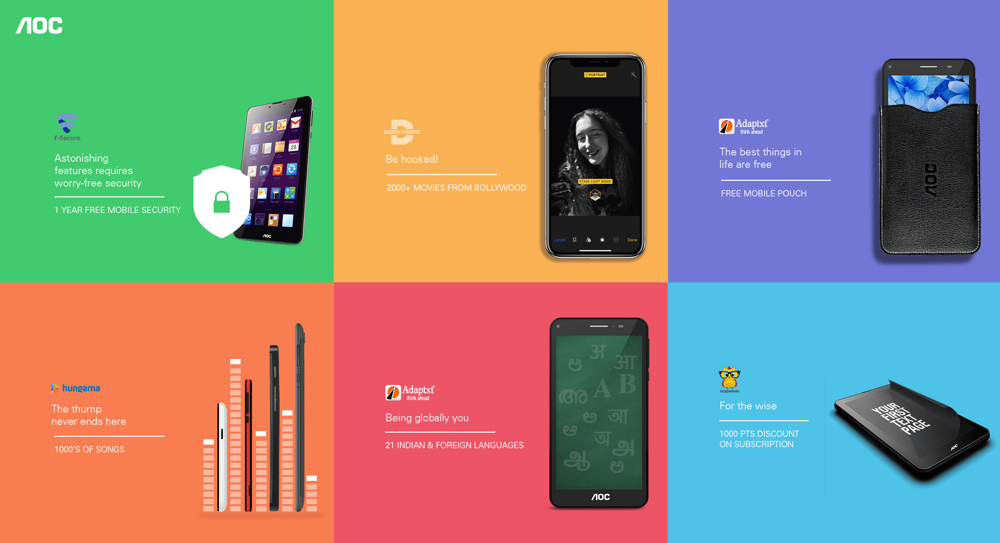
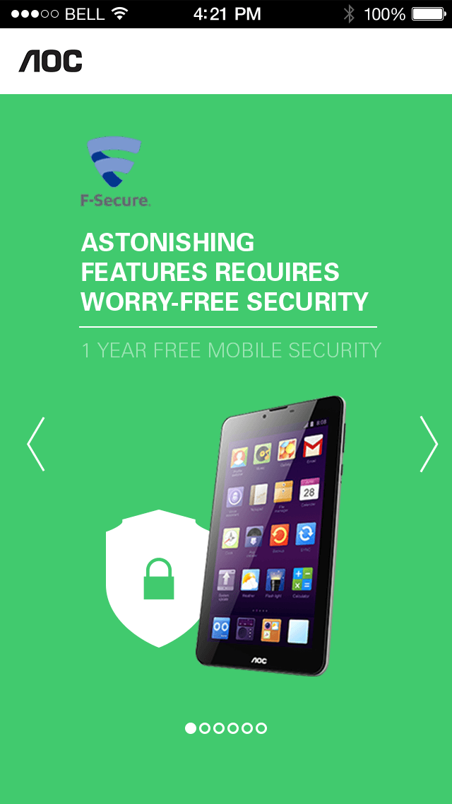

# krds Assignment

## Skills required

- React / Angular / Vue
- CSS / LESS / SASS
- Javascript

## Data Api

[https://krds-assignment.github.io/aoc/api-assets/data.json](https://krds-assignment.github.io/aoc/api-assets/data.json)

## Instructions

- This assignment must use one of the following technologies
  - React
  - Angular
  - Vue
- You've given an api which returns a mock json data
- Use this api url to fetch the data
  (All images & text are given in api data)
- Create reusable components, if possible
- Display the data as you see it in the design
- Make sure to display carousel view in small screens
  (refer mobile design)
- Use your CSS skill to create responsive layout
- Prefer plain CSS/LESS/SASS. Don't use CSS framework (eg. Bootsrtap)
- Use "Open Sans" google web font
- You can use any 3rd party js libraries

## Desktop Design

## Mobile Design

